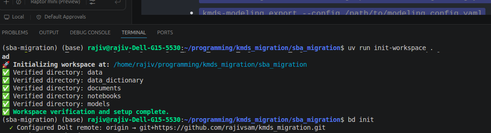
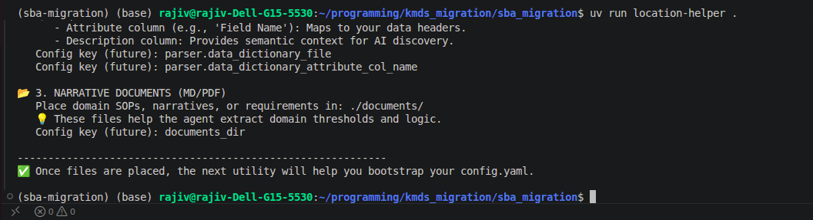
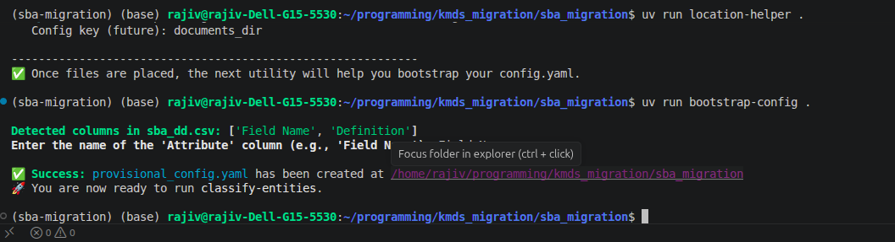

# SBA Migration with KMDS - A Step-by-Step Guide

This guide shows the main KMDS workflow for SBA data migration, from repository setup through the featurization and modeling decisions that establish a production-ready solution.

**1. Repository Setup:**

Create a new Git repository for your SBA migration project. This will serve as the foundation for your work.  *The KMDS SBA migration diagram is shown below.*

**2. UV Project Initialization:**

Since UV (Universal Value) is used for KMDS, initialize a UV project for your model. This ensures the necessary environment is set up. *The KMDS SBA migration diagram above shows the workflow.*

**3. Install KMDS & Dependencies:**

Install KMDS and its supporting packages. Refer to the KMDS GitHub repository ([https://github.com/rajivsam/kmds](https://github.com/rajivsam/kmds)) for detailed installation instructions.  Specifically, include the `kmds-ui` package for visualizing the resulting knowledge graph. *The KMDS SBA migration diagram above shows the same overall workflow.*

**4. Workspace Initialization:**

Run the `init-workspace` utility. This will create an alias to the `init-workspace-sba.png` file located in the `images` directory. *See Step 4 illustrated by the workspace initialization screenshot below.*

**5. File Location Helper:**

Use the `location-helper` utility to identify where to place your project artifacts. A link to the output of this utility, `images/location-helper_output.png`, will be provided. *See Step 5 illustrated by the location helper output screenshot below.*

Carefully review the output and move your specific project artifacts as indicated.

**6. Provisional Configuration Bootstrap:**

Run the `bootstrap-config` utility to create a provisional configuration file for data cleaning.  A link to the generated configuration, `images/bootstrap_config_creation.png`, is included. *See Step 6 illustrated by the bootstrap configuration screenshot below.*

Verify the working directory carefully before proceeding. Rename the configuration file from `provisional_config.yaml` to `config.yaml`.  In the `config.yaml` file, indicate entities to be tagged for entity-specific feature engineering.  For the SBA example, tag geographical addresses, including latitude and longitude.

**7. Parser Handshake Filters:**

Run the `classify entities` utility. This generates the parser handshake filters. Links to the filter views are provided: `images/parser_handshake_view_1.png` and `images/parser_handshake_view_2.png`. *See Step 7 illustrated by the parser handshake filter screenshot below.*

**8. Clean Dataset:**

Run the `clean-dataset` utility.  After completion, review the cleaner’s produced data profile. A link to the profile: `images/cleaner_null_report.png`.  Additionally, review the recommended cleaning actions - link `images/cleaning_recommendations.png`. *See Step 8 illustrated by the data cleaning results screenshot below.*

**9. Notebook Analysis:**

Use a notebook (`../notebooks/clean_sba_dataset.ipynb`) to examine the recommendations and tagged entities.  Review the proposed types and dataset types. *Open the notebook at [../notebooks/clean_sba_dataset.ipynb](../notebooks/clean_sba_dataset.ipynb).* Note: These are provisional assignments and may require modification.

**10. Metadata Review:**

Inspect the metadata generated by the parser. The notebook, `../notebooks/clean_sba_dataset.ipynb`, contains details about this metadata. *Open the notebook at [../notebooks/clean_sba_dataset.ipynb](../notebooks/clean_sba_dataset.ipynb).* The featurization process must align with the modeling approach and the featurization plans developed by the modeling team (refer to the `../agent_documents` directory of this repository for these design decisions). After reviewing the metadata, run [../notebooks/feature_advisor_sba_example.ipynb](../notebooks/feature_advisor_sba_example.ipynb) to get recommendations from the featurization advisor component on what makes sense for this dataset.

Specifically, the featurization should encode geographic attributes as latitude and longitude.  Develop a clustering model differentiating between good (paid-in-full) and distressed loans, then derive a distance feature to the nearest good and distressed clusters for each loan. Accounts should be created for category levels without sufficient support. Finally, account for any missing values within the dataset.

**11. Modeling Guidance:**

Modeling and featurization decisions are described in markdown and guided by data science expertise. Review [../agent_documents/sba_problem_framing_collab.md](../agent_documents/sba_problem_framing_collab.md) and [../agent_documents/sba_modeling_requirements.md](../agent_documents/sba_modeling_requirements.md) for the problem framing, success criteria, and the domain judgment that underpin this solution. Data science experience, expertise, and judgement are critical skills in developing the model, even though this solution is AI assisted.
